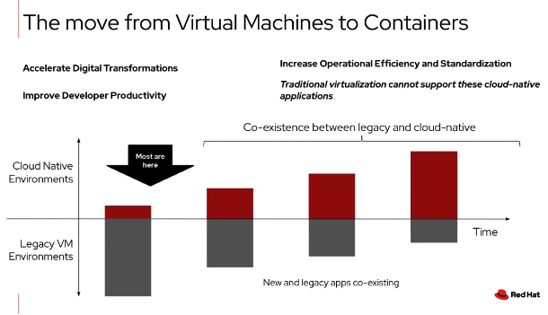
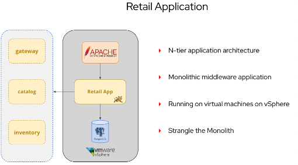
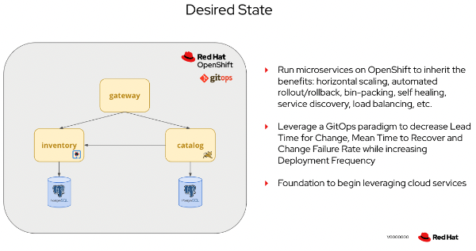

# Segment 2: Application modernization and developer experience

At this point we’ve seen how OpenShift provides a common experience across all infrastructure platforms, whether they’re on-premises, in the cloud, or anywhere in between.
Advanced Cluster Manager provides a single interface for administrators to manage OpenShift cluster deployments, including applications deployments if we choose.
Together, OpenShift and ACM enable administrators to be more efficient and effective at managing the lifecycle of OpenShift clusters, regardless of where they’re at and
what they’re used for. Let’s look at the other end of the spectrum: developers.

* Key takeaways from the Application Modernization Segment 2 are listed below :
** Organizations want to speed up software delivery and move to cloud native
** Tooling empowers and enables developers to unlock innovation and rapidly iterate applications
** Red Hat provides a platform and tools to facilitate application modernization and rapidly expanding features / fixing issues

Applications are the reason the business exists, it provides the service, feature, capability, or even the product sold by the company. As a result, it’s critically
important to improve the life of developers too!

Let’s begin by looking at the tools available to facilitate application modernization and follow that with an example developer workflow of writing code,
testing the application, and - ultimately - pushing it into the next phase of deployment to production. In the last section, we’ll look at how to leverage additional
capabilities from Red Hat’s managed OpenShift Data Science offering to assist with Application modernization.

# Segment 2 Section 1: Application Modernization

* Key takeaways for this section are listed below:
** Applications have a broad spectrum of readiness for containers and cloud-native.
** Red Hat and OpenShift offer platforms, tools, learning, and services to assist you with the journey.

Red Hat, and many other organizations, have been highlighting the advantages of containers, cloud-native development, and kubernetes for several years now.
However, despite what you’ve been hearing, reality is that there are still a vast number - the majority - of applications which do not run in containers and
are a long way from being ready for Kubernetes.

To help make this process easier, Red Hat supports the Konveyor community project, which is downstreamed as the Red Hat Migration Toolkits for Applications, Containers,
and Virtualization. For our demo, we are going to focus on application modernization, using the Migration Toolkit for Applications to facilitate moving an on-premise application
hosted in virtual machines to being deployed using containers to an OpenShift / Kubernetes cluster hosted anywhere we want.

The application we’re using is a simple 3-tier retail application. We’ll be focusing on the inventory service for this part, taking steps to assess the work needed to first break down
the application into component microservices, move them into containers, and finally deploy the application to OpenShift.

The ideal end state would be to have the services decoupled from each other to enable horizontal scale, independent scale, per-service load balancing, and many of the cloud-native
functions we expect from modern applications.

< demo, MTA questionnaire >

Let’s begin with the Migration Toolkit for Applications. Like other OpenShift features, it is deployed using OperatorHub to an OpenShift cluster. Once available, we can begin assessing
the application so that we may begin planning the steps for modernization.

The application inventory is, as the name implies, where we can track each (micro)service. The assessment is a questionnaire intended to be completed by the development team and
service owner to highlight potential risk areas which will need additional consideration and evaluation.
In our example application here, we’ve identified several medium risk and one high risk item.
Scrolling down to the details, we get information about which items have risk and why that risk is present when containerizing.

For example, our high risk item is pointing out that a hard coded IP is being used by the inventory service to connect to the database.
Since specific Kubernetes services, e.g. the database, can change IPs at any time, we know already that some refactoring will need to be done with the application to ensure that
we use proper service discovery practices and abstract access to avoid complicated configuration and potentially brittle deployments.

However, the migration toolkit is not limited to just doing a “paper assessment” of the application. Using the analysis function, we can evaluate the source code of the application
for known potential issues.

< demo, MTA analysis setup >

From the migration toolkit console, we start this process by creating a new project, giving it a name, and uploading the code.

We then need to decide which transformation targets the toolkit will evaluate. As we discussed earlier, this inventory application is going to be containerized, so we’ll select that option.
Additionally, we want to make sure that there are no leftover artifacts from the application running on a Windows Server node (or developer desktop), so we’ll also select the boxes for Linux and OpenJDK.

The tool is capable of other assessments too, for example evaluating a SpringBoot application to determine its ability to run using the Red Hat runtimes, but those aren’t relevant for this application.

Next, we’ll select the specific packages for the application. This is a large application, so we want to limit it to just the code which implements business logic, so let’s do that now.

The advanced option allows us to define custom rules for known issues. During the assessment phase we identified that the application was loading configuration data from a file, something that is not
cloud native friendly - we will want to use ConfigMaps or Secrets in Kubernetes instead. We’re going to upload a rule definition that searches for any instances of that logic being used to make it easier
to identify where refactoring needs to happen across the entire code base.

We won’t make any other changes here. Since the analysis can take some time to evaluate all the rules against the code base, we’ll jump over to a completed instance.

< demo, MTA analysis result >

This project was run using the exact configuration we just showed, so the result would be the same, just without waiting. Let’s start by looking at the reports area, select the WAR file associated with the application.
There’s a tremendous amount of data available in this output, but we’re going to focus on the issues identified since that will directly equate to work needed from the development team to refactor and update the application for Kubernetes.

Scrolling down to the “cloud mandatory” section, there are three categories with issues. One of the identified issues is the statically configured IP address we mentioned before.
The report highlights exactly where in the code - which file and which line - the issue was found. There are also several instances of our custom rule being found, where application configuration is being read from the file system.

The migration toolkit gives us a fast and concise way to identify potential issues as we modernize the application, but we still need to rely on our developer teams to do the work. OpenShift can make their lives a little easier though.
