:guid: %guid%
:ocp_username: %ocp_username%
:openshift_console_url: %aws_dev_a_provision_data.openshift_console_url%
:openshift_cluster_admin_password: %aws_dev_a_provision_data.openshift_cluster_admin_password%
:rhodh_dashboard: %aws_dev_a_provision_data.rhodh_dashboard%
:gitea_console_url: %aws_dev_a_provision_data.gitea_console_url%
:gitea_admin_username: %aws_dev_a_provision_data.gitea_admin_username%
:gitea_admin_password: %aws_dev_a_provision_data.gitea_admin_password%

# Segment 2 Section 3: AI/ML integration

* Key takeaways from this section are:
** Resources to expand features and grow capabilities are available on-demand, without having to spend significant time or money learning how to deploy them
** Data science teams have latitude to experiment and develop models using open source tools in a hosted environment

At this point we’ve seen tools make suggestions about how to modernise an application from a monolith
to microservices and the developer tools available to facilitate the process, including automation
and integration for removing toil from developer inner and outer loop activities.

For this segment we’re going to look at how to add new capabilities to the application using machine
learning powered by Red Hat OpenShift Data Science.

OpenShift Data Science provides a platform for data science teams to build, train, and deploy AI/ML
applications and features to OpenShift applications deployed in the hybrid cloud.

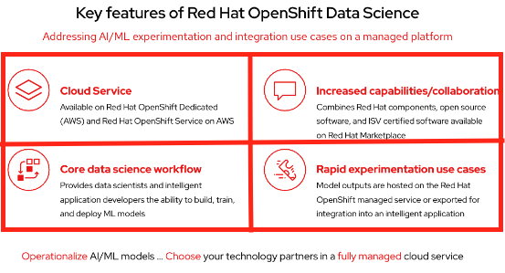

Data science is complex and it’s no secret that many organisations are challenged by finding the right
expertise to create effective models, the infrastructure needed to train those models,
and - ultimately - the confidence to integrate and deploy those features and applications into production.

RHODS provides a managed cloud service, hosted on AWS, to remove the barriers around getting access to
the resources and deploying plus managing the toolsets needed by data scientists. This has been done
working with the Red Hat and Amazon SREs along with many of our partners to provide a bevy of tools to
best suite the scientist, the data, and the model being created.

Once created, the models are exportable to be hosted where you need them - on-premise, at the edge, in the
cloud - or can continue to be hosted in RHODS as an extension of your application’s functionality.

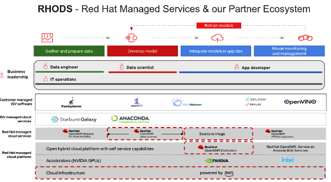

The demo we’ll go through in a moment will focus on three areas of data science. Experimentation to create
the model, building the source code to integrate the model with the application, and finally deploying to
production, wherever the application may be hosted.

Around this, and what’s not always seen in the demos, is a large number of partners that add value and
capability to what we’re seeing. For example, partnering with AWS enables us to bring OpenShift and your
applications into the cloud and closer to where data is ingested aggregated from IoT devices or
other edge applications.

We also work closely with hardware partners such as NVIDIA and Intel to bring key capabilities from their
hardware into OpenShift, for example, the NVIDIA Driver Operator simplifies the process of integrating GPUs
with OpenShift-hosted applications and models, bringing cost and efficiency optimisations across all OpenShift
footprints - both on-premise and in the cloud.

And, of course, there’s a large number of other partners offering both managed and self-hosted capabilities
integrated with OpenShift.

With that foundation in place, let’s explore the demo.

Login to OCP Console of `OHC AWS Dev Cluster A` {openshift_console_url} to get the Application URL using your Segment 2 login details.
Same information will be provided to you via email.
Select `htpass_provider` and then login using `admin` username and {openshift_cluster_admin_password} as per your environment details.
Select Networking -> Routes for `cicd` project.
and
Select the URL for `object-detection-app-git`.

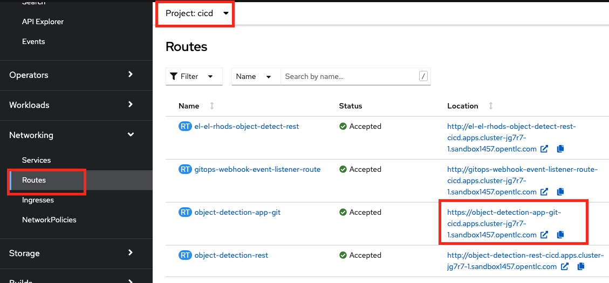

Open `object-detection-app-git` app URL on your mobile browser and scan the below image.
You should allow this application access to your camera. You can do the same activity through your laptop browser as well but then the
below image should be on an alternate device or you can click a selfie where your shirt/t-shirt is detected with a discount coupon on it.

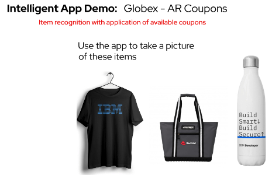

The premise of what we’re going to be seeing is that we want to expand the application by using machine learning to offer coupons to customers
of our storefront based on what they’re ordering. If you’d like to get hands-on with an example, scan the image with your phone using the above
app url, then take a picture of the three items. What you will see is that it detects a shirt so a coupon will be offered for that item.

Let’s dig into how this is possible using Red Hat OpenShift Data Science.

OpenShift Data Science is, at its core, a hosted JupyterHub instance with integrations from Red Hat and our partners available via an app
store-like experience.

We can see on the enabled application page here that we’ll be using JupyterHub, OpenVINO, and Anaconda to build and host the model.
But, there are others available too. The explore page shows the full list of integrations available, both hosted and self-managed,
with OpenShift Data Science. An example of this is the Seldon Deploy integration. If your scientists are using Seldon today,
you can deploy that today to meet their needs, but still integrate with OpenShift Data Science to provide a platform with
resources for them to experiment and develop the models.

Let’s start by launching JupyterHub. You open the RHODS Dashboard URL {rhodh_dashboard} with `admin` user and password of `openshift admin console`.
Once you are in Red Hat OpenShift Data Science Dashboard, `Launch Application` for JupyterHub which is the only Enabled application.
You can browse through the ecosystem by checking Explore tab on the left side of your screen. Come back to Enabled application.
Since you have launched application, it will open another browser tab where you login using the same username/password which you used earlier.
Here you select the notebook image (Select Standard Data Science image for this workshop).This notebook server will start a containerized instance
on the hosted OpenShift instance with a set of pre-integrated data science libraries available, determined by the notebook image you choose.
For example, if you want maximum flexibility to create and use the tools of your choice, you can choose the minimal Python image.
As we progress down the list of options there are other libraries available out of the box - PyTorch and TensorFlow being two of the
most common - and, on the right side, several options from our ecosystem partners will show once you configure those.

As a group, these offerings give flexibility to the data science team to choose the tools - whether locally created, or open source tools
from Red Hat and our partners - that they need to most effectively do their job.

The only other decision to make on this page is how many resources we want to allocate to the JupyterHub instance. The t-shirt offerings
listed here have varying amounts of CPU and memory available so that you can choose the right amount for your application. Since we’re
creating a containerized instance, it’s easy to revisit the choice and re-deploy with a different size if needed later. You may want to start
by selecting a small one.

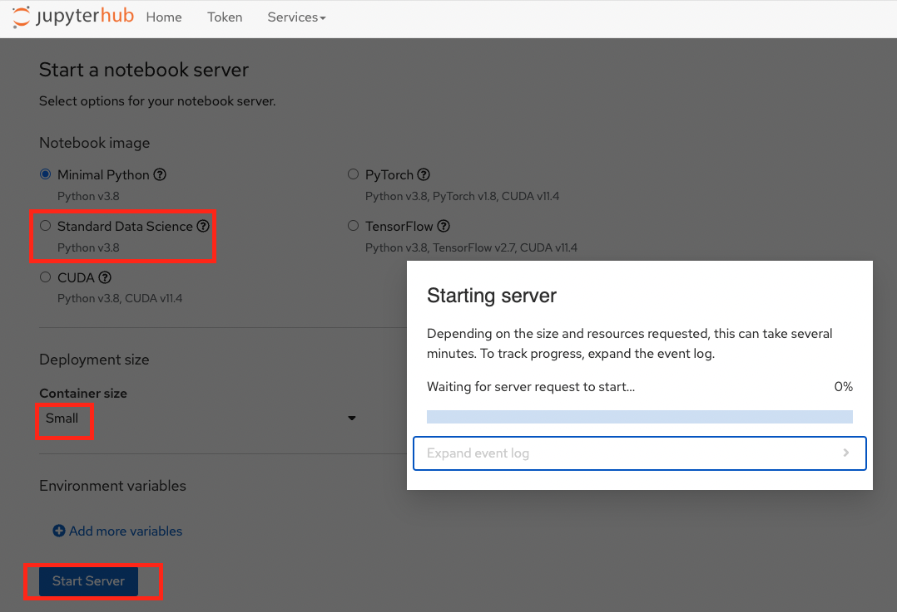

After a few moments, the container image will deploy and we can launch the JupyterHub interface. Let’s clone a repo with the code we’ll
be using for the model. You can clone your gitea repo - `arc-model`. Login to the gitea url {gitea_console_url} provided in your environment
with {gitea_admin_username} as the user and {gitea_admin_password} as the password, select `dev-user` on the left of your screen
to access all the repositories and get the git url for `arc-model`.

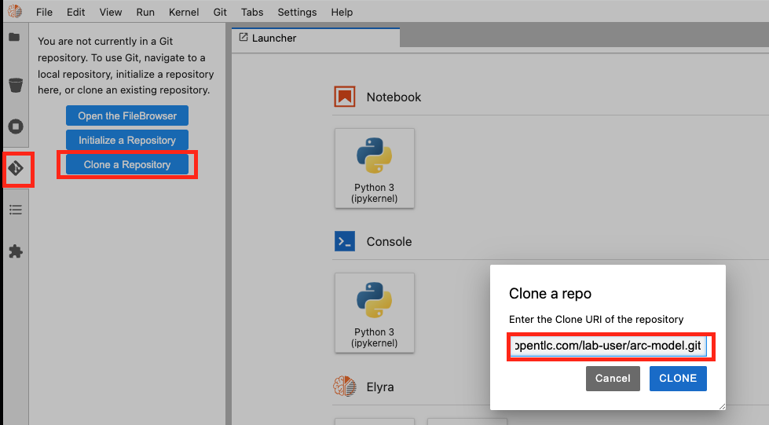

Now that we have the code, we can explore how RHODS brings together the data science and development teams. If you’re not familiar with
JupyterHub, the core concept is the workbook, which represents a guided flow to document the work and test code associated with building
a model. Go tho `arc-model` folder and select `2_predict.ipynb` prediction workbook, which will become the application component for generating
coupon codes based on the buyer activities, we see multiple sections for each step of the process. Each of these can be edited “live” and
applied as we work through.
If I change something, you’ll see that the code is executed and the output shown here in the workbook’s interface. This is extremely useful
for data scientists to rapidly iterate, but also provides the ability to review the history too.

The core of the coupon application we used at the start of this demo is the prediction function seen here. Breaking down what we see here,
there is a model that’s already been created for this demo and is available in the repo, we then have the predict, detect, and
clean detections functions. Together, these make up the heart of the ML application that brings the coupon functionality to the store
application.

In short, the application will take the image and process it through the model, which will return a set of scores for what was detected
in the image, for example the probability that a bottle or shirt was detected in the image. Looking a bit further down the code,
you can see that we’ve decided that if a bottle is detected we’re assigning a value to the coupon to be returned to the application.

The next phase of the workbook is testing the prediction function we reviewed in the previous step. JupyterHub makes it easy to test,
validate, and iterate on those steps to ensure that the output is what we want. The Python we see here will input an image, `retail.jpg`
stored in the same directory imported from the Git repo, apply the prediction function against it, then output the prediction, and
assigned coupon value, results. This is just a demo, but ideally we would be running this against real data from the application,
even some of the data used to build the model, so that we can validate the results.

The final segment in the workbook is to use the JSON output from the predict function to add a visual component to the result.
What this code segment does is overlay a box for the detected item to the input image, then return the new image as output.
If you used the QR code earlier to take a picture and submit it, this would be the output you received back.

The culmination of all this can be seen at the bottom, where we test everything together instead of in the three stages above.
The model detected a bottle, which triggered the drawing function to add a box around it and the app to offer a 15% off coupon to
the submitter.

At this point, we’ve created the basis for an application as the output from our data science exploration activity.
If we look at the `prediction.py` file, we see that the code used in these steps has been put into a file we can utilize in the application,
and the wsgi.py file implements a web service endpoint that can be used to submit the images, perform the analysis, and return the values back.

The next step would be to deploy that microservice to an OpenShift cluster. That can be done using the traditional methods or using
Pipelines like we saw earlier. The code we’re using here came from a Git repo and the container image we are using for JupyterHub has
the git tools available, we can use that to make changes to the ML application, push them to a repo, and - just like before - trigger a
Pipeline to build, test, and redeploy based on the changes.

Moving back to the OpenShift Pipelines view from earlier, you’ll notice we have an `app-aiml-objedetect-pipeline` AI/CI pipeline.

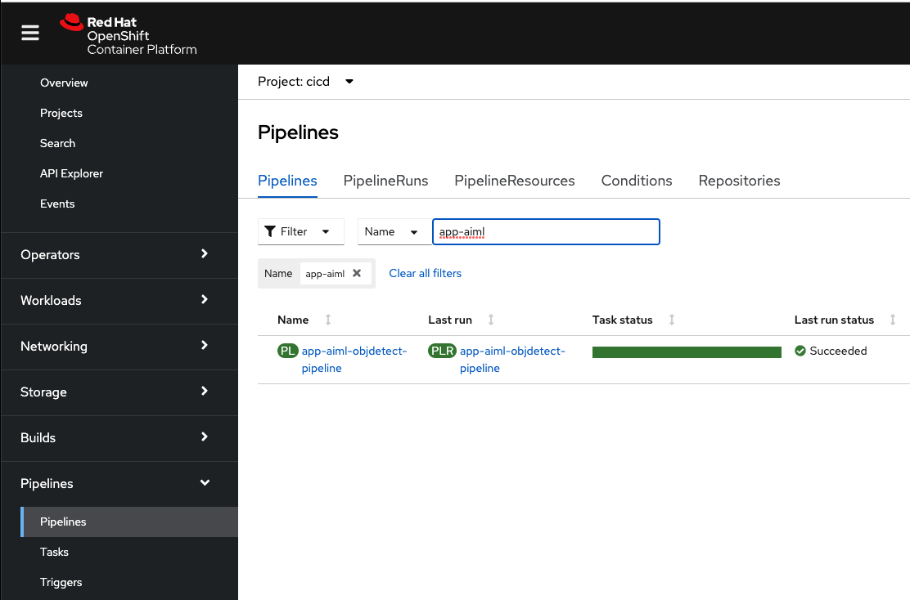

This one is different than before, taking steps to build, test, and validate the model function so that we can verify that the output
and functionality is expected as shown in the below pipeline run.

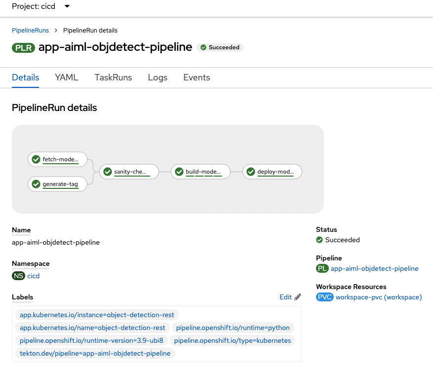

You’ll note that this process is distinct from the inventory service we saw earlier, with its own path to
production. This testing process for this functionality to be deployed to production is more in-depth because we don’t just want to test the
machine learning input/output standalone, that should already be done by the data science team, but how the application sends data
to the model, receives the data back, and what happens with that.

You can trigger the pipeline by sending a webhook trigger from your arc-model repository in gitea.

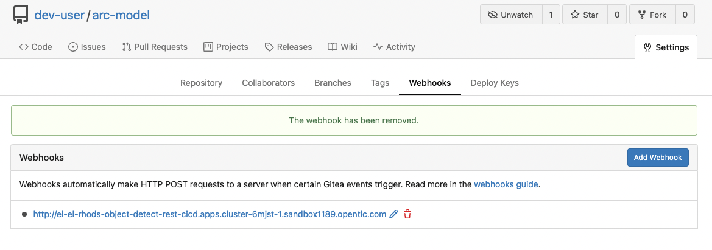
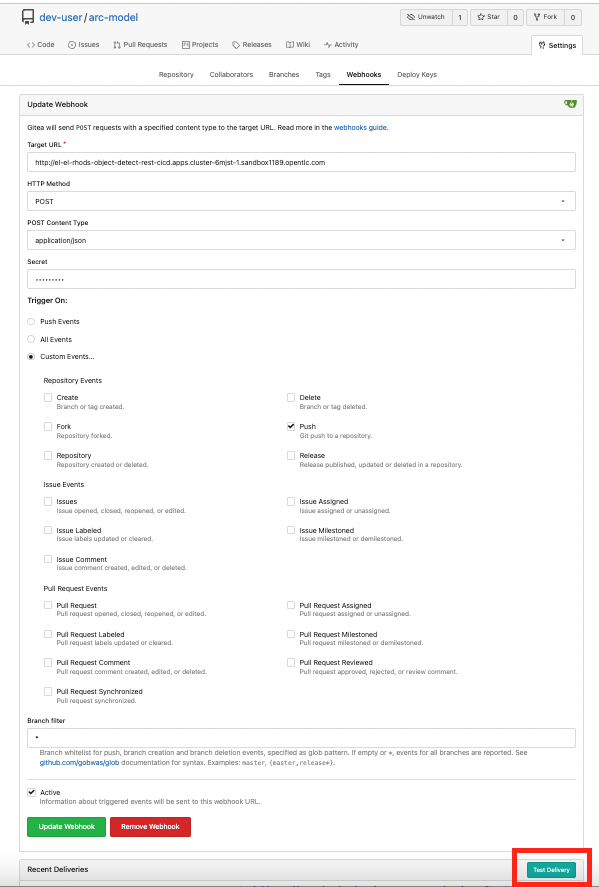

When you go to arc-model repositoy Webhooks, select the link starting with `http://el-el-rhods-object-detect-rest-cicd******` and once you are
into this link, at the end you will see a green button `Test Delivery`, select and this will trigger a pipeline run which you can check
in OpenShift Console, for cicd project `app-aiml-objdetect-pipeline` pipeline, select the pipeline run to check the progress of the pipeline run.

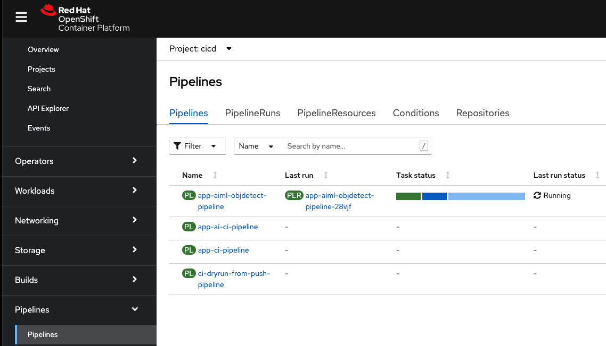

For our demo application here, we’ve decoupled the work that the data science team and the app dev team are doing, allowing them to
focus on their strengths and only the aspects that are relevant to their role.
